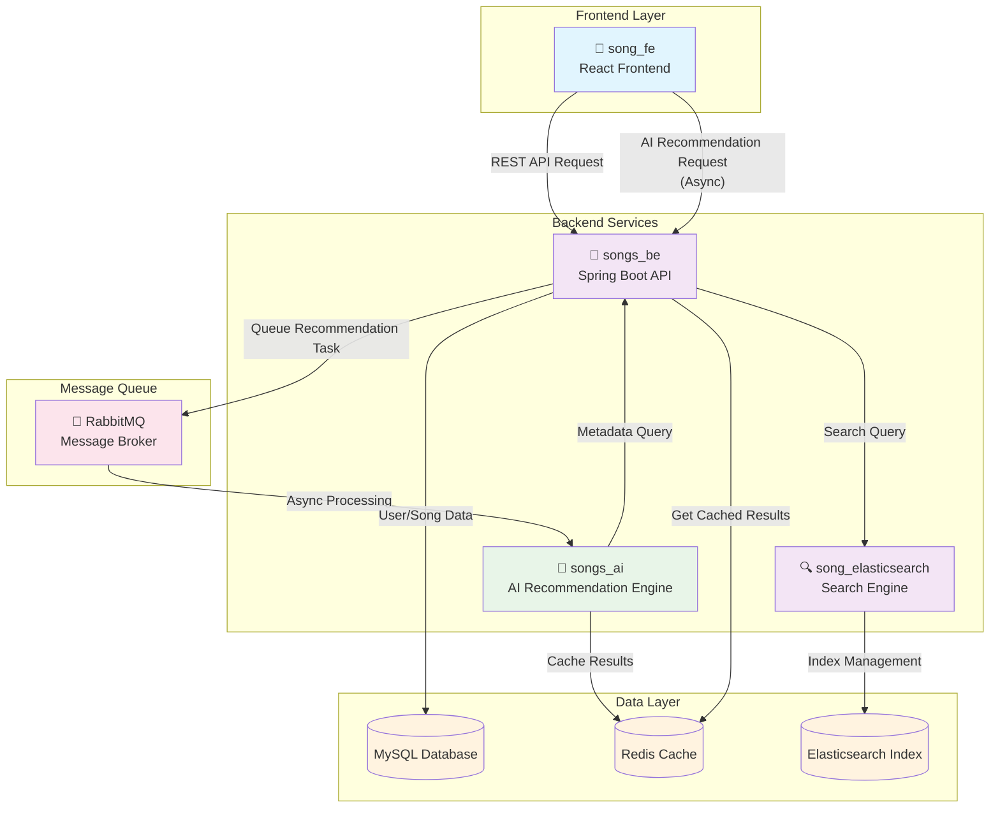

# 🎵 Songs AI - 지능형 음악 추천 시스템

**개인의 음악 취향을 학습하여 완벽한 플레이리스트를 만들어주는 AI 기반 음악 추천 서비스**

## 🌟 프로젝트 소개

Songs AI는 사용자의 음악 취향을 깊이 분석하여 개인화된 노래 추천을 제공하는 지능형 시스템입니다.
OpenAI GPT 모델을 활용하여 사용자의 선호도를 이해하고, 수많은 곡 중에서 취향에 맞는 완벽한 선곡을 찾아드립니다.

> **📦 마이크로서비스 아키텍처**: 이 레포지토리는 AI 추천 엔진을 담당하며, [메인 백엔드](https://github.com/Zara8170/songs_be), [프론트엔드](https://github.com/Zara8170/song_fe), [검색 엔진](https://github.com/Zara8170/song_elasticsearch)과 함께 완전한 음악 서비스를 구성합니다.

### 🎯 핵심 가치

- **개인화**: 각 사용자의 고유한 음악 취향을 정확히 파악
- **지능형 분석**: AI가 장르, 분위기, 아티스트 선호도를 종합적으로 분석
- **실시간 학습**: 사용자의 피드백을 통해 지속적으로 추천 품질 향상
- **확장성**: 대용량 음악 데이터베이스와 다수 사용자를 효율적으로 처리

### 🚀 주요 특징

#### 🧠 AI 기반 취향 분석

- **다차원 분석**: 장르, 분위기, 아티스트, 시대별 선호도를 종합 분석
- **자연어 처리**: 사용자의 음악 선호도를 자연어로 이해하고 해석
- **패턴 인식**: 사용자의 숨겨진 음악적 패턴과 취향 발굴

#### ⚡ 고성능 추천 엔진

- **실시간 추천**: 빠른 응답시간으로 즉시 추천 결과 제공
- **스마트 캐싱**: Redis 기반 지능형 캐시로 성능 최적화
- **배치 처리**: Celery를 활용한 대용량 데이터 비동기 처리

#### 🎨 개인화된 플레이리스트

- **상황별 추천**: 시간대, 기분, 활동에 맞는 맞춤 선곡
- **다양성 보장**: 편향되지 않은 균형 잡힌 음악 발견
- **새로운 발견**: 취향과 유사하지만 새로운 음악 탐색 지원

## 🏗 시스템 아키텍처

### 🌐 프로젝트 생태계

Songs AI는 여러 개의 독립적인 레포지토리로 구성된 마이크로서비스 아키텍처를 채택하고 있습니다. 각 레포지토리는 특정 역할을 담당하며, 서로 연동되어 완전한 음악 추천 서비스를 제공합니다.

#### 📦 주요 레포지토리

| 레포지토리                                                                  | 역할         | 기술 스택               | 설명                                       |
| --------------------------------------------------------------------------- | ------------ | ----------------------- | ------------------------------------------ |
| **🤖 [songs_ai](https://github.com/Zara8170/song_ai)**                      | AI 추천 엔진 | Python, FastAPI, OpenAI | 현재 레포지토리 - AI 기반 음악 추천 백엔드 |
| **🎵 [songs_be](https://github.com/Zara8170/songs_be)**                     | 메인 백엔드  | Java, Spring Boot       | 사용자 관리, 인증, 노래 데이터 관리        |
| **🎨 [song_fe](https://github.com/Zara8170/song_fe)**                       | 프론트엔드   | React, TypeScript       | 사용자 인터페이스 및 웹 애플리케이션       |
| **🔍 [song_elasticsearch](https://github.com/Zara8170/song_elasticsearch)** | 검색 엔진    | Elasticsearch           | 고성능 음악 검색 및 필터링 시스템          |

#### 🔄 서비스 간 연동 구조



#### 📋 각 레포지토리 상세 역할

**🤖 [Songs AI (현재 레포지토리)](https://github.com/Zara8170/song_ai)**

- OpenAI GPT를 활용한 지능형 음악 취향 분석
- RabbitMQ에서 추천 요청을 비동기로 수신 및 처리
- 개인화된 추천 알고리즘 엔진
- 추천 결과를 Redis에 캐시 저장
- APScheduler 기반 정기적 배치 처리 (스케줄링)

**🎵 [Songs Backend](https://github.com/Zara8170/songs_be)**

- Spring Boot 기반 메인 백엔드 API 서버
- 사용자 인증 및 권한 관리 (JWT, OAuth2)
- 음악 메타데이터 및 사용자 데이터 관리
- RabbitMQ를 통한 AI 추천 작업 큐잉 및 관리
- Redis에서 캐시된 추천 결과 조회 및 제공
- 플레이리스트 및 좋아요 기능 제공

**🎨 [Songs Frontend](https://github.com/Zara8170/song_fe)**

- React 기반 반응형 웹 애플리케이션
- 직관적인 사용자 인터페이스 제공
- 실시간 음악 검색 및 추천 결과 표시
- 개인화된 플레이리스트 관리 기능

**🔍 [Songs Elasticsearch](https://github.com/Zara8170/song_elasticsearch)**

- Elasticsearch 기반 고성능 음악 검색 엔진
- 다국어 검색 지원 (한국어, 일본어, 영어)
- 초성 검색 및 오타 보정 기능
- 실시간 검색 인덱싱 및 최적화

### 📁 현재 레포지토리 구조 (songs_ai)

```
songs_ai/
├── 🌐 api/                 # FastAPI 웹 애플리케이션
│   ├── main.py            # API 서버 진입점
│   ├── app.py             # FastAPI 앱 설정
│   └── routes/            # REST API 엔드포인트
│
├── 🧠 core/               # 핵심 비즈니스 로직
│   └── recommendation_service.py  # 추천 알고리즘 엔진
│
├── 🔌 services/           # 외부 서비스 연동 레이어
│   ├── ai_service.py      # OpenAI GPT 연동
│   ├── database_service.py # 음악 데이터베이스 연동
│   ├── cache_service.py   # Redis 캐시 관리
│   └── redis_scheduler.py # 스케줄링 서비스
│
├── ⚙️ workers/            # 백그라운드 작업 처리 (향후 확장 예정)
│   ├── celery_app.py      # 미사용
│   └── tasks.py           # 미사용
│
├── 📊 models/             # 데이터 모델
│   ├── data_models.py     # 비즈니스 도메인 모델
│   └── api_models.py      # API 스키마
│
└── 🛠 config/             # 시스템 설정
    ├── settings.py        # 환경 설정
    ├── prompts.py         # AI 프롬프트 템플릿
    └── redis.py           # Redis 연결 설정
```

## 💡 작동 원리

### 🔄 추천 프로세스

1. **사용자 추천 요청**: 프론트엔드에서 백엔드로 AI 추천 요청
2. **비동기 작업 큐잉**: 백엔드가 RabbitMQ에 추천 작업을 큐잉
3. **AI 엔진 처리**: Songs AI가 RabbitMQ에서 작업을 수신하여 처리
4. **사용자 데이터 수집**: 좋아요, 재생 이력, 평점 데이터 수집
5. **AI 취향 분석**: GPT 모델이 사용자의 음악적 선호도를 자연어로 분석
6. **후보군 필터링**: 데이터베이스에서 취향과 관련된 곡들을 사전 필터링
7. **지능형 선별**: AI가 후보 곡들을 평가하여 최적의 추천 리스트 생성
8. **캐시 저장**: 완성된 추천 결과를 Redis에 저장
9. **결과 조회**: 백엔드가 Redis에서 캐시된 추천 결과를 조회하여 응답

### 🎵 추천 알고리즘의 특징

- **AI 기반 분석**: OpenAI GPT를 활용한 지능형 취향 분석
- **콘텐츠 기반 필터링**: 곡의 장르, 분위기, 템포 등 음악적 특성 분석
- **협업 필터링**: 유사한 취향 사용자들의 선호도 패턴 활용
- **하이브리드 접근**: 다양한 추천 기법을 조합하여 정확도 향상
- **캐시 기반 최적화**: Redis를 통한 빠른 추천 결과 제공

## 🔧 기술 스택

### 🚀 백엔드 & API

- **FastAPI**: 고성능 비동기 웹 프레임워크
- **Python 3.11+**: 최신 언어 기능 활용
- **Uvicorn**: ASGI 서버로 빠른 HTTP 처리

### 🧠 AI & 머신러닝

- **OpenAI GPT-4**: 자연어 기반 취향 분석
- **LangChain**: AI 모델 통합 및 프롬프트 관리
- **Transformers**: 추후 Hugging Face 모델 지원 예정

### 💾 데이터 저장소

- **MySQL**: 음악 메타데이터 및 사용자 정보 저장
- **Redis**: 추천 결과 캐싱 및 세션 관리
- **PyMySQL**: 데이터베이스 연결 및 ORM

### ⚙️ 백그라운드 처리 & 메시지 큐

- **RabbitMQ**: 서비스 간 비동기 메시지 브로커
- **APScheduler**: 정기적인 배치 작업 스케줄링
- **Redis**: 작업 결과 캐싱 및 임시 데이터 저장

### 🐳 인프라 & 배포

- **Docker**: 컨테이너화된 배포
- **Docker Compose**: 다중 서비스 오케스트레이션
- **Nginx**: 리버스 프록시 (프로덕션 환경)

### 📊 모니터링 & 관측성

- **Prometheus**: 메트릭 수집 및 저장
- **Grafana**: 대시보드 및 시각화
- **Redis Insight**: Redis 데이터베이스 모니터링
- **Flower**: Celery 작업 큐 모니터링

## 🚀 빠른 시작

### 📋 사전 요구사항

- Python 3.11 이상
- Redis Server
- MySQL Database
- OpenAI API Key

### ⚡ AI 추천 엔진만 실행

```bash
# 저장소 클론
git clone https://github.com/Zara8170/song_ai.git
cd song_ai

# 의존성 설치
pip install -r requirements.txt

# 환경 변수 설정
cp .env.example .env
# .env 파일에서 API 키 및 데이터베이스 설정

# 서버 실행
python main.py
```

### 🌟 전체 시스템 설정 (모든 레포지토리)

완전한 Songs AI 서비스를 구동하려면 모든 레포지토리를 함께 설정해야 합니다:

```bash
# 1. 모든 레포지토리 클론
git clone https://github.com/Zara8170/songs_be.git      # 메인 백엔드
git clone https://github.com/Zara8170/song_ai.git       # AI 추천 엔진
git clone https://github.com/Zara8170/song_fe.git       # 프론트엔드
git clone https://github.com/Zara8170/song_elasticsearch.git  # 검색 엔진

# 2. 각 서비스 의존성 설치 및 설정
cd songs_be && ./gradlew build && cd ..
cd song_ai && pip install -r requirements.txt && cd ..
cd song_fe && npm install && cd ..
cd song_elasticsearch && docker-compose up -d && cd ..

# 3. 환경 변수 설정 (각 레포지토리)
# songs_be/.env
# song_ai/.env
# song_fe/.env

# 4. 서비스 순차 실행
cd songs_be && java -jar build/libs/songs_be.jar &
cd song_ai && python main.py &
cd song_fe && npm start &
```

### 🐳 Docker로 실행

```bash
# 전체 스택 실행 (권장)
docker-compose up -d

# 로그 확인
docker-compose logs -f
```

## 📡 API 사용법

### 🎯 추천 요청

```bash
POST /recommend
{
  "user_id": "user123",
  "favorite_songs": [
    {"title": "노래제목", "artist": "가수명", "genre": "팝"}
  ],
  "count": 20
}
```

### ⚡ 캐시된 추천 조회

```bash
POST /recommend/cached
{
  "user_id": "user123"
}
```

### 🔄 사용자 선호도 업데이트

```bash
POST /favorites/updated
{
  "user_id": "user123",
  "action": "add_favorite",
  "song_data": {...}
}
```

## 📊 모니터링 & 관측성

Songs AI는 프로덕션 환경에서의 안정적인 서비스 운영을 위해 종합적인 모니터링 시스템과 연동됩니다.

### 🎯 모니터링 아키텍처

```
┌─────────────────┐    ┌─────────────────┐    ┌─────────────────┐
│   Songs AI      │───▶│   VM Exporters  │───▶│  외부 Prometheus │
│   Application   │    │   (메트릭 수집)  │    │   모니터링 서버   │
└─────────────────┘    └─────────────────┘    └─────────────────┘
         │                       │                       │
         ▼                       ▼                       ▼
┌─────────────────┐    ┌─────────────────┐    ┌─────────────────┐
│     Redis       │    │   Node Exporter │    │    Grafana      │
│   (캐시 상태)    │    │  (시스템 리소스) │    │   대시보드       │
└─────────────────┘    └─────────────────┘    └─────────────────┘
```

### 🛠 기존 모니터링 환경 연동

현재 VM에 설정된 Exporter들을 통해 외부 모니터링 서버에서 Songs AI 서비스를 모니터링하고 있습니다.

#### 🎯 현재 모니터링 현황

✅ **활성화된 모니터링 요소들:**

- **Node Exporter**: VM 시스템 리소스 모니터링 (CPU, 메모리, 디스크, 네트워크)
- **외부 Prometheus**: 메트릭 수집 및 저장 서버 연동
- **외부 Grafana**: 대시보드를 통한 시각화 및 알림
- **Songs AI App**: `/metrics` 엔드포인트를 통한 애플리케이션 메트릭 노출

#### 📡 메트릭 엔드포인트 노출

Songs AI 애플리케이션에서 다음 엔드포인트를 통해 메트릭을 제공합니다:

```bash
# 애플리케이션 메트릭 확인
curl http://localhost:8000/metrics

# 시스템 메트릭 확인 (Node Exporter 통해 수집)
curl http://localhost:9100/metrics
```

### 📈 Prometheus 메트릭

#### 🎵 애플리케이션 메트릭

- **추천 요청 수**: `songs_ai_recommendations_total`
- **평균 응답 시간**: `songs_ai_recommendation_duration_seconds`
- **AI 분석 성공률**: `songs_ai_ai_analysis_success_rate`
- **캐시 히트율**: `songs_ai_cache_hit_rate`

#### 🔧 시스템 메트릭

- **CPU 사용률**: `cpu_usage_percent`
- **메모리 사용량**: `memory_usage_bytes`
- **디스크 I/O**: `disk_io_operations_total`
- **네트워크 트래픽**: `network_bytes_total`

### 📊 Grafana 대시보드

#### 🎯 주요 대시보드

1. **📈 Songs AI 서비스 개요**

   - 전체 서비스 상태 및 핵심 지표
   - 실시간 추천 요청 현황
   - AI 분석 성능 메트릭

2. **🧠 AI 추천 엔진 모니터링**

   - OpenAI API 호출 통계
   - 추천 알고리즘 성능 분석
   - 사용자 취향 분석 정확도

3. **💾 Redis 캐시 모니터링**

   - Redis Insight를 통한 로컬 모니터링
   - 캐시 데이터 및 키 현황 확인

4. **⚙️ 시스템 리소스 모니터링**
   - CPU, 메모리, 디스크 사용률
   - 네트워크 트래픽 분석
   - 컨테이너 상태 모니터링

### 🔔 알림 및 알럿

#### ⚠️ 중요 알럿 규칙

- **서비스 다운**: 30초 이상 응답 없음
- **높은 오류율**: 5분간 에러율 5% 초과
- **메모리 부족**: 메모리 사용률 85% 초과
- **캐시 실패**: Redis 연결 실패

#### 📱 알림 채널

- **Slack**: 실시간 알림 및 상태 업데이트
- **Email**: 중요 이벤트 및 일일 리포트
- **Webhook**: 외부 시스템 연동

### 🛠 모니터링 접속 정보

#### 📊 외부 모니터링 서버 연동

현재 VM에 설정된 환경에서는 외부 모니터링 서버를 통해 모니터링이 진행됩니다:

- **Prometheus**: 외부 모니터링 서버에서 VM의 Exporter들로부터 메트릭 수집
- **Grafana**: 외부 서버의 대시보드에서 Songs AI 서비스 상태 확인
- **Node Exporter**: VM 시스템 리소스 메트릭 제공 (포트: 9100)

#### 💾 로컬 모니터링 도구

- **Redis Insight**: http://localhost:5540 (Redis 데이터베이스 직접 모니터링)
- **APScheduler 로그**: 정기적 배치 작업 실행 상태 모니터링

### ⚙️ 모니터링 설정

#### 🔧 외부 Prometheus 서버 설정 예시

외부 모니터링 서버의 Prometheus에서 Songs AI VM을 모니터링하기 위한 설정:

```yaml
# prometheus.yml (외부 모니터링 서버)
global:
  scrape_interval: 15s
  evaluation_interval: 15s

scrape_configs:
  - job_name: "songs-ai-app"
    static_configs:
      - targets: ["<VM_IP>:8000"] # Songs AI 애플리케이션
    metrics_path: "/metrics"
    scrape_interval: 10s

  - job_name: "songs-ai-system"
    static_configs:
      - targets: ["<VM_IP>:9100"] # Node Exporter
```

#### 📡 VM Exporter 상태 확인

```bash
# Node Exporter 상태 확인
systemctl status node_exporter

# Songs AI 애플리케이션 메트릭 엔드포인트 확인
curl http://localhost:8000/metrics
```

### 🏥 헬스 체크

#### 🔍 서비스 상태 확인

```bash
# API 서버 상태
curl http://localhost:8000/health

# Redis 상태
docker exec redis redis-cli -a ${REDIS_PASSWORD} ping

# 전체 서비스 상태
docker-compose ps
```

#### 📊 메트릭 엔드포인트 확인

```bash
# Songs AI 애플리케이션 메트릭
curl http://localhost:8000/metrics

# Node Exporter 메트릭 (시스템 리소스)
curl http://localhost:9100/metrics
```

#### 🔗 외부 모니터링 서버 연결 상태

```bash
# 외부 Prometheus에서 타겟 상태 확인
curl http://<MONITORING_SERVER>:9090/api/v1/targets

# Grafana 대시보드 접속 (외부 모니터링 서버)
# http://<MONITORING_SERVER>:3000
```

### 🚨 트러블슈팅

#### 일반적인 문제들

1. **외부 모니터링 서버에서 메트릭을 수집하지 못할 때**

   ```bash
      # VM에서 Exporter 상태 확인
   systemctl status node_exporter

   # 방화벽 설정 확인 (포트 9100, 8000 오픈 필요)
   sudo ufw status
   sudo firewall-cmd --list-ports

   # 네트워크 연결 테스트
   telnet <VM_IP> 9100
   ```

2. **Songs AI 애플리케이션 메트릭이 노출되지 않을 때**

   ```bash
   # 애플리케이션 로그 확인
   docker-compose logs api

   # 메트릭 엔드포인트 직접 확인
   curl http://localhost:8000/metrics

   # 포트 바인딩 확인
   netstat -tlnp | grep 8000
   ```

3. **외부 모니터링 서버 연결 확인**

   ```bash
   # 외부 Prometheus 타겟 상태 확인
   curl http://<MONITORING_SERVER>:9090/api/v1/targets

   # VM에서 외부 서버로 네트워크 테스트
   ping <MONITORING_SERVER>
   ```

## 🎨 프로젝트 하이라이트

### 🌟 혁신적인 기능들

#### 🎭 상황별 맞춤 추천

- **시간대 고려**: 아침에는 상쾌한 곡, 저녁에는 차분한 곡 추천
- **기분 분석**: 사용자의 현재 감정 상태에 맞는 음악 선별
- **활동 기반**: 운동, 공부, 휴식 등 상황에 최적화된 플레이리스트

#### 🔮 지능형 음악 발견

- **숨겨진 보석**: 인기도는 낮지만 취향에 완벽한 곡들 발굴
- **장르 크로스오버**: 평소 듣지 않던 장르에서 새로운 취향 발견
- **아티스트 확장**: 좋아하는 아티스트와 유사한 신인 아티스트 추천

#### 📊 실시간 학습 시스템

- **피드백 즉시 반영**: 좋아요/싫어요가 바로 다음 추천에 영향
- **청취 패턴 분석**: 건너뛰기, 반복재생 등 행동 패턴 학습
- **취향 진화 추적**: 시간에 따른 음악 취향 변화 감지 및 적응

### 🚀 성능 최적화

#### ⚡ 빠른 응답 시간

- **다단계 캐싱**: L1(메모리) + L2(Redis) 캐시 전략
- **비동기 메시지 큐**: RabbitMQ를 통한 Non-blocking 추천 처리
- **비동기 처리**: 모든 I/O 작업을 비동기로 처리하여 성능 극대화
- **스케줄링 최적화**: APScheduler를 통한 정기적 캐시 갱신으로 효율성 향상

#### 📈 확장성 설계

- **마이크로서비스 아키텍처**: 각 기능별 독립적 확장 가능
- **로드 밸런싱**: 트래픽 분산으로 안정적인 서비스 제공
- **데이터베이스 샤딩**: 대용량 데이터 처리를 위한 분산 저장

## 🔮 향후 계획

- [ ] **음성 인식 지원**: "기분 좋은 노래 틀어줘" 같은 자연어 명령 지원
- [ ] **소셜 기능**: 친구들과 플레이리스트 공유 및 추천
- [ ] **추천 고도화**: 감정 분석 및 상황별 맞춤 추천 개선

## 🤝 기여하기

Songs AI는 오픈소스 프로젝트입니다! 다음과 같은 방식으로 기여할 수 있습니다:

- 🐛 **버그 리포트**: 이슈 등록으로 버그 신고
- 💡 **기능 제안**: 새로운 아이디어나 개선사항 제안
- 🔧 **코드 기여**: Pull Request를 통한 직접적인 개발 참여
- 📚 **문서화**: 사용법이나 개발 가이드 문서 개선

## 📞 연락처

프로젝트에 대한 문의나 협업 제안은 언제든 환영합니다!

- **GitHub**: [@Zara8170](https://github.com/Zara8170)
- **프로젝트 레포지토리들**:
  - 🤖 [AI 추천 엔진](https://github.com/Zara8170/song_ai)
  - 🎵 [메인 백엔드](https://github.com/Zara8170/songs_be)
  - 🎨 [프론트엔드](https://github.com/Zara8170/song_fe)
  - 🔍 [검색 엔진](https://github.com/Zara8170/song_elasticsearch)

---

**🎵 음악으로 세상을 더 아름답게 만드는 Songs AI**

_Made with ❤️ by passionate music lovers_
